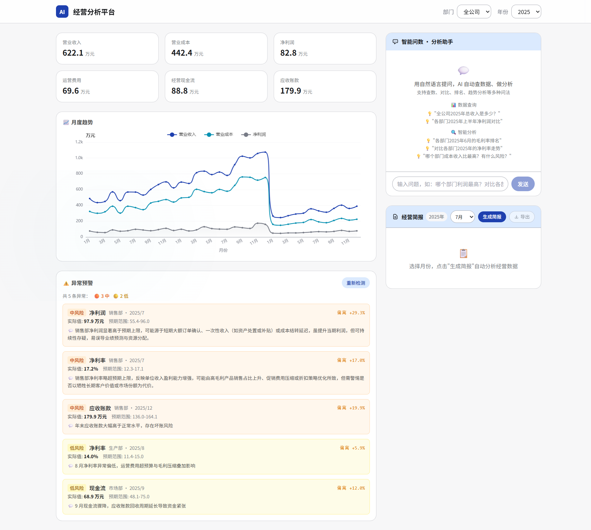
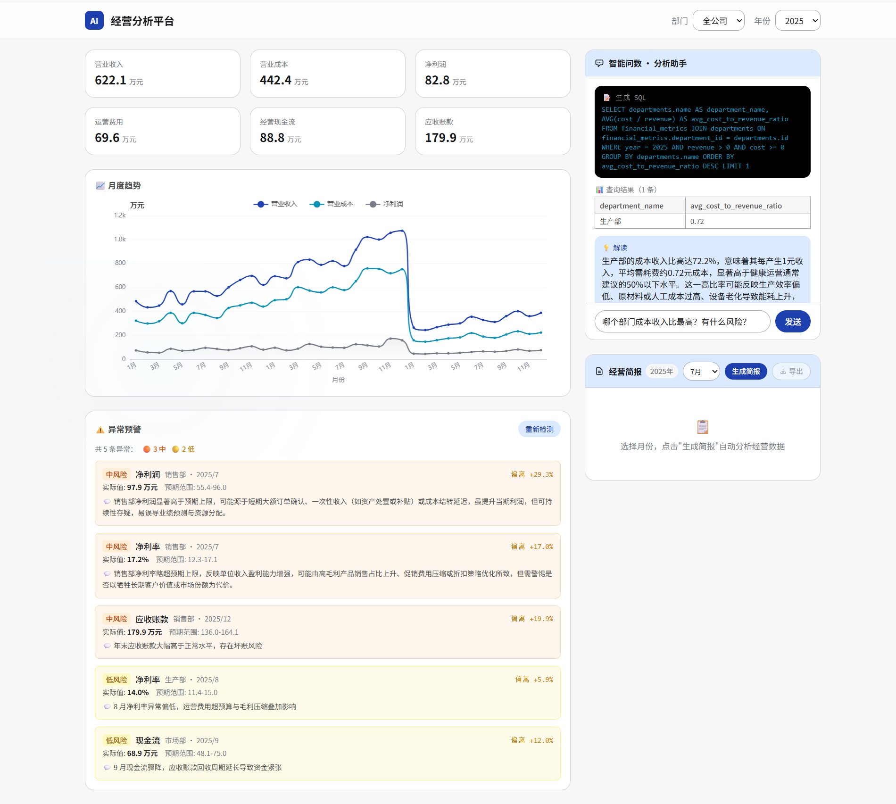

# AI 赋能企业经营分析平台

> 🏆 江西财经大学「AI赋能财务·以赛代训」实战 · 方向四·经营分析

**一句话**：用 AI 重构经营分析的三个核心环节——异常发现（ML）、数据查询（NL2SQL）、报告生成（LLM）——从"人找数据"到"数据找人"。

---

## 技术栈

| 层 | 选型 |
|---|------|
| 后端 | Python FastAPI + SQLAlchemy + SQLite |
| ML | scikit-learn Isolation Forest（无监督异常检测） |
| LLM | 通义千问 qwen-plus（主）/ DeepSeek（备） |
| 前端 | Vue 3 + Vite + Tailwind CSS + ECharts |
| 图表 | ECharts（趋势折线图） |
| Markdown | marked（前端渲染 LLM 输出） |

---

## 快速启动

### 环境要求

- Python 3.11+
- Node.js 18+
- Git Bash（Windows）

### 1. 后端（3 步）

```bash
cd backend

# Step 1: 安装依赖
python -m pip install -r requirements.txt

# Step 2: 配置 API Key
cp .env.example .env
# 编辑 .env，填入阿里云百炼 API Key
# LLM_API_KEY=sk-xxxxxxxxxxxxxxxx

# Step 3: 启动服务
python -m uvicorn app.main:app --reload --port 8000
```

启动后访问 http://localhost:8000/docs 查看 Swagger 文档。

### 2. 前端（3 步）

```bash
cd frontend

# Step 1: 安装依赖
npm install

# Step 2: 启动开发服务器
npm run dev
```

打开浏览器访问 http://localhost:5173

### 3. 运行测试

```bash
cd backend
python -m pytest tests/ -v
```

---

## API 端点速查

| 方法 | 路径 | 说明 |
|------|------|------|
| GET | `/api/health` | 健康检查 |
| GET | `/api/departments` | 部门列表（销售部/生产部/市场部） |
| GET | `/api/indicators` | 指标查询（支持 department_id/year/month 筛选） |
| GET | `/api/anomalies` | 异常记录查询（支持 department_id/severity/year 筛选） |
| POST | `/api/anomalies/detect` | 触发 Isolation Forest 异常检测 |
| POST | `/api/query/nl2sql` | 自然语言→SQL 查询 |
| POST | `/api/report/generate` | 管理层经营简报生成 |
| POST | `/api/report/export` | 简报 ZIP 导出（HTML + 图表 PNG + CSS） |

---

## 项目结构

```
ai企业赋能财务分析/
├── backend/
│   ├── app/
│   │   ├── main.py              # FastAPI 入口 + CORS
│   │   ├── models.py            # SQLAlchemy 数据模型（3 表）
│   │   ├── schemas.py           # Pydantic 接口契约（前后端唯一合同）
│   │   ├── database.py          # SQLite 连接
│   │   ├── api/
│   │   │   ├── departments.py   # 部门列表
│   │   │   ├── indicators.py    # 指标查询
│   │   │   ├── anomalies.py     # 异常检测 + 查询
│   │   │   ├── nl2sql.py        # NL2SQL 核心
│   │   │   └── report.py        # 简报生成
│   │   └── services/
│   │       ├── anomaly_detector.py  # Isolation Forest
│   │       ├── llm_client.py        # LLM API 封装
│   │       ├── data_generator.py    # 模拟数据生成
│   │       └── report/
│   │           ├── theme.py         # matplotlib Steep 样式配置
│   │           ├── charts.py        # 4 图表渲染器
│   │           ├── html_builder.py  # HTML 报告模板
│   │           └── packager.py      # ZIP 打包
│   ├── tests/
│   │   ├── conftest.py          # pytest fixtures
│   │   └── test_api.py          # 7 端点集成测试
│   ├── data/
│   │   └── finance.db           # SQLite 数据库（自动生成）
│   ├── .env.example             # API Key 配置模板
│   └── requirements.txt
├── frontend/
│   ├── src/
│   │   ├── App.vue              # 根组件 + 状态管理
│   │   ├── main.js              # Vue 入口
│   │   ├── api/index.js         # 后端 API 封装层
│   │   └── components/
│   │       ├── NavBar.vue       # 顶部导航（部门/年份选择）
│   │       ├── Dashboard.vue    # 仪表盘容器
│   │       ├── KpiCards.vue     # KPI 指标卡片
│   │       ├── TrendChart.vue   # ECharts 趋势折线图
│   │       ├── AnomalyAlert.vue # 异常预警列表
│   │       ├── ChatPanel.vue    # 智能问数对话
│   │       └── ReportPanel.vue  # 简报展示
│   └── vite.config.js
├── prompts/
│   ├── nl2sql_system.txt        # NL2SQL 系统提示词（含完整 Schema）
│   ├── nl2sql_examples.json     # Few-shot 示例（10 种查询类型）
│   └── report_template.txt      # 简报生成模板
├── docs/
│   ├── DESIGN.md                # Steep 设计系统文档（色板/字体/图表规则）
│   ├── PPT大纲.md               # PPT 5 页结构
│   ├── 答辩脚本.md              # 答辩三问逐字稿（5分40秒）
│   └── 演示操作手册.md          # 比赛现场操作指南
└── README.md                    # 本文件
```

---

## 三个 AI 角色

| 角色 | 技术 | 做什么 |
|------|------|--------|
| 🛡️ **数据哨兵** | Isolation Forest (ML) | 9 维度自动发现异常，实时预警 |
| 🌉 **数据翻译官** | 通义千问 (LLM) | 自然语言→SQL→查询结果→中文解释 |
| 📝 **报告写手** | 通义千问 (LLM) | 数据→Markdown 管理层简报 → HTML/ZIP 一键导出 |

## 设计系统

全栈统一 **Steep** 设计（基于 [Refero Steep](https://styles.refero.design/) — "Soft dawn on a marble dashboard"）：
- 色板：13 个 token（8 灰度 + 5 数据色），图表只用 Steel Blue + Cyan 两条彩色线
- 前端：Tailwind 自定义主题（`tailwind.config.js`），8 组件 + 全局样式全部对齐
- 导出报告：matplotlib 200 DPI 渲染，4 图表各有独立 CSS 背景纹理（账簿线/点阵/条纹/同心圆）
- 详见 [`docs/DESIGN.md`](docs/DESIGN.md)

## 降级策略

```
完整版：NL2SQL + 异常检测(ML) + 简报生成(LLM)
降级版：NL2SQL + 简报生成(LLM) + 异常检测(规则引擎)
最简版：NL2SQL + 简报生成(LLM)  ← 仍然满足"AI应用"要求
```

---

## 数据库 Schema

### departments（部门表）
| 字段 | 类型 | 说明 |
|------|------|------|
| id | INTEGER PK | — |
| name | VARCHAR(50) | 销售部 / 生产部 / 市场部 |
| manager | VARCHAR(20) | 负责人 |

### financial_metrics（月度经营指标表）
| 字段 | 类型 | 说明 |
|------|------|------|
| revenue | REAL | 营业收入（万元） |
| cost | REAL | 营业成本（万元） |
| operating_expense | REAL | 运营费用（万元） |
| net_profit | REAL | 净利润（万元） |
| cash_flow | REAL | 经营现金流（万元） |
| accounts_receivable | REAL | 应收账款（万元） |

> 派生指标（毛利、毛利率、净利率）由 NL2SQL 引擎动态计算——这是 AI 能力的体现。

---

## 演示截图



